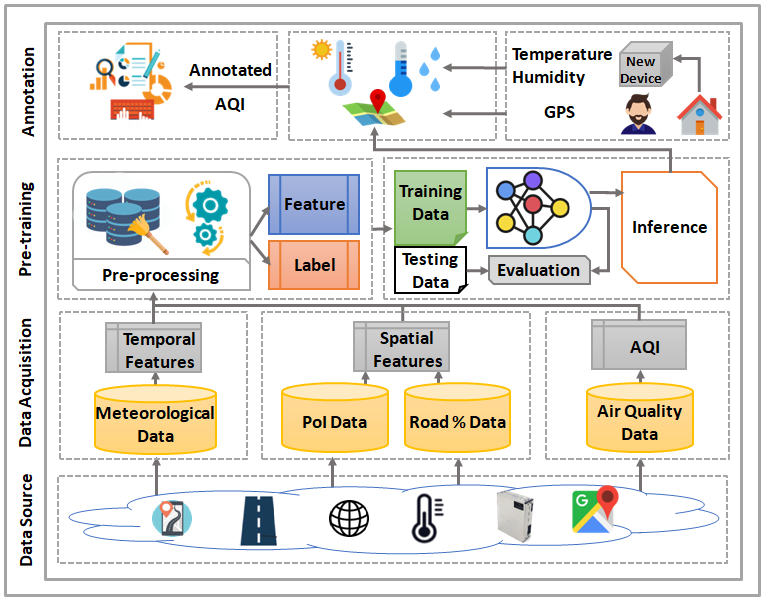
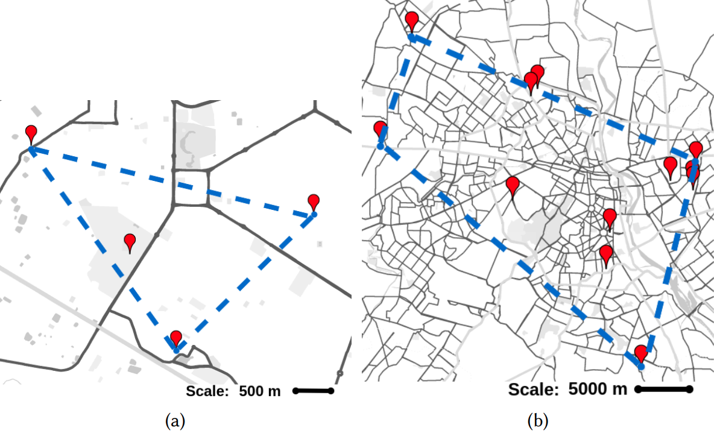

# <strong><em>AQuaMoHo</em></strong> Framework
Efficient air quality sensing serves as one of the essential services provided in any recent smart city. Mostly facilitated by sparsely deployed Air Quality Monitoring Stations (AQMSs) that are difficult to install and maintain, the overall spatial variation heavily impacts air quality monitoring for locations far enough from these pre-deployed public infrastructures. To mitigate this, we in this paper propose a framework named <em>AQuaMoHo</em> that can annotate data obtained from a low-cost thermo-hygrometer (as the sole physical sensing device) with the AQI labels, with the help of additional publicly crawled Spatio-temporal information of that locality. At its core, <em>AQuaMoHo</em> exploits the temporal patterns from a set of readily available spatial features using an LSTM-based model and further enhances the overall quality of the annotation using temporal attention. From a thorough study of two different cities, we observe that <em>AQuaMoHo</em> can significantly help annotate the air quality data on a personal scale.
<p align="center">
      <br><strong>Fig.1: Framework</strong>
</p>

## In-house Dataset
We have selected four locations in Durgapur and deployed AQMDs (Air Quality Monitoring Devices), as shown in Fig.2 (a), for sensing the pollutants, particles, and meteorological parameters. The AQMDs provide the data samples with an adaptive sampling rate, i.e., they provide the samples whenever the new data sample differs from the previous data sample and store the data in the cloud. The Geospatial imagery of the locations is used to extract the information regarding the Point of Interests (PoI) at different locations such as Natural land, Park, Road networks, Educational institutions, etc. The Table explains the intuition behind the selection of locations to deploy the AQMDs.

|    `Device_ID`       | `Remarks`          |
|:---------------------|:-------------------|
|    AQMD-1            |        This location is a residential zone with small educational regions, high natural land coverage of 71.42\%, and a road network coverage of 24\%.           |
|    AQMD-2            |        This location is a densely populated market area that has multiple bus depots. The region also has natural land and human-made structures coverage of 48\% and 17\%, respectively. There are many road networks in the area, almost covering 37\% of the region.           |
|    AQMD-3            |        This location can be regarded as the heart of the city. It consists of PoIs like various attractions, including shopping complexes, food plazas, and cinema halls with hospitals. The location is situated near industrial areas and has a high presence of road networks, including highways.            |
|    AQMD-4            |        This location has the highest presence of educational institutions, which occupies 22\% of this location. Here, abundant greenery is also present, with 39\% natural land coverage and 12\% human-made structures.        |

<p align="center">
      <br>
      <strong>Fig. 2: Device deployment in (a) Durgapur, (b) Delhi</strong>
</p>

### Publicly available data
we have selected 37 AQMSs (Air Quality Monitoring Stations), that are deployed sparsely in the Delhi as shown in Fig. 2 (b). The data samples are collected through publicly available [web portal](https://app.cpcbccr.com/ccr/\#/) provided by Central Pollution Control Board (CPCB), and Indian Meteorological Data (IMD).

## Installation

To install use the following commands.
```bash
git clone https://github.com/prasenjit52282/AQuaMoHo.git
pip install -r requirements.txt
```

## Directory Structure


```
AQuaMoHo
└── Data                            /*-------Dataset--------*/
└── library
    └── models
        └── rf.py
        └── rnn.py
    └── constants.py
    └── experiments.py
    └── helper.py
    └── metrics.py
    └── utils.py
└── logs
    └──figs
└── monitor
└── augument.py
└── onebyone.py
└── train.py
└── varryDiv.py
└── varryWindow.py
└── README.md
```

# Reference
To refer the <strong><em>AQuaMoHo</em></strong> framework or the dataset, please cite the following works.

Download the paper from here [ACM BuildSys 2021](https://dl.acm.org/doi/abs/10.1145/3486611.3486663) | [ArXiv](https://arxiv.org/pdf/2204.11484.pdf).

BibTex Reference:
```
@inproceedings{sharma2021can,
  title={Can i go for a roof walk today? know your housing's air quality from a thermo-hygrometer},
  author={Sharma, Praveen Kumar and Karmakar, Prasenjit and Chatterjee, Soumyajit and Roy, Abhijit and Mandal, Santanu and Chakraborty, Sandip and Nandi, Subrata and Saha, Sujoy},
  booktitle={Proceedings of the 8th ACM International Conference on Systems for Energy-Efficient Buildings, Cities, and Transportation},
  pages={91--100},
  year={2021}
}
```
```
@article{pramanik2022aquamoho,
  title={AQuaMoHo: Localized Low-Cost Outdoor Air Quality Sensing over a Thermo-Hygrometer},
  author={Pramanik, Prithviraj and Karmakar, Prasenjit and Sharma, Praveen Kumar and Chatterjee, Soumyajit and Nandi, Subrata and Chakraborty, Sandip and Saha, Mousumi and Saha, Sujoy},
  journal={arXiv preprint arXiv:2204.11484},
  year={2022}
}
```
For questions and general feedback, contact Sujoy Saha (sujoy.saha@cse.nitdgp.ac.in).

<!-- Training
---------
1.(split/overall/sim/dis)-rf \& rnn
* python3 train.py --city="Dgp"
* python3 train.py --city="Delhi"

2.(Augument exp- annotate and add train data)
* python3 augument.py

3.(OneByOne exp- add monthly data one by one)
* python3 oneByone.py

4.(varry device exp- varry number of test devices[1-6]-C2)
* python3 varryDiv.py

5.(Varry Window size experiments from ws param)
* python3 varryWindow.py --city="Dgp" --ws="6,12,18,24,30"
* python3 varryWindow.py --city="Delhi" --ws="6,12,18,24,30"

<hr>

Restoring
---------
1.(split/overall/sim/dis)-rf \& rnn
* python3 train.py --city="Dgp" --restore
* python3 train.py --city="Delhi" --restore

2.(Augument exp- annotate and add train data)
* python3 augument.py --restore

3.(OneByOne exp- add monthly data one by one)
* python3 oneByone.py --restore

4.(varry device exp- varry number of test devices[1-6]-C2)
* NA(python3 varryDiv.py)

5.(Varry Window size experiments from ws param)
* python3 varryWindow.py --city="Dgp" --ws="6,12,18,24,30" --restore
* python3 varryWindow.py --city="Delhi" --ws="6,12,18,24,30" --restore

<hr>

Plotting
--------
* run plot.ipynb file -->